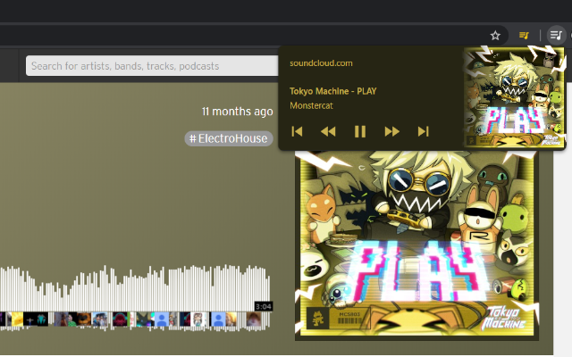

# 🎵 Media Session Master

Media Session Master is a chrome extension that utilizes [Chrome's MediaSession API](https://developers.google.com/web/updates/2017/02/media-session) in sites that don't fully support it.

MediaSession API allows you to pause & play media within Chrome's UI and extends to the systems ability to recognize media being played. (You can use the pause & play buttons on your F1-12 keys)

## Installation

The extension is not available in the Chrome Web Store yet, but you are able to download the ZIP of the source code and install it locally.

You can download the development branch [here](https://github.com/Snazzah/MusicSessionMaster/archive/master.zip) or the stable branch [here](https://github.com/Snazzah/MusicSessionMaster/archive/stable.zip).

Once downloaded, in order to load the package:
- **Extract the folder that is inside the ZIP** somewhere special.
- Head to the Extensions page (`Chrome > Settings > Extensions`)
- Flip the `Developer Mode` switch on the top right of the screen.
- Click `Load unpacked` on the top left and select the folder you extracted.
- Appreciate the effort!

## Contributions
are greatly appreciated! Here's how you can contribute:
- You can create an [issue](https://github.com/Snazzah/MediaSessionMaster/issues) if you wanna report bugs, suggest features, or nitpick at grammar.
- You can also create [pull requests](https://github.com/Snazzah/MediaSessionMaster/pulls) if you want to make features yourself! Make sure you push to the `master` branch and give a detailed description of your pull request!

## Credits
Mostly inspired by [Animal Crossing Music Extension](https://acmusicext.com/), check it out!
I use [Chrome Bootstrap](https://github.com/roykolak/chrome-bootstrap) for the options page.
Music Session Master is licensed under the [zlib license](./LICENSE).